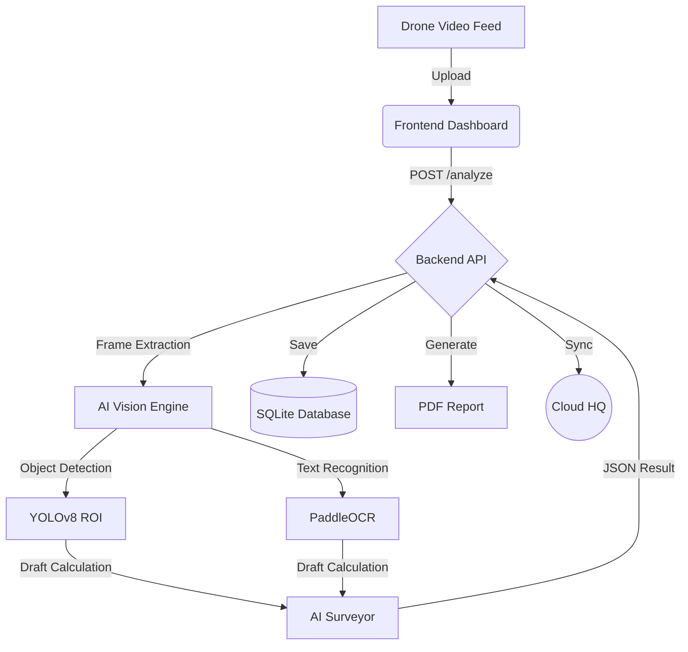

# 🚢 Plimsoll AI - Autonomous Draft Survey System


## 📋 Overview
Plimsoll AI eliminates the dangers and inaccuracies of manual marine draft surveys. Using autonomous drones and computer vision, it calculates vessel displacement with sub-centimeter precision, even in moderate sea states.

### Key Features
- **👀 Computer Vision Engine**: Automatic waterline detection and draft mark reading.
- **🌊 Sea State Physics**: Temporal noise reduction and wave stabilization logic.
- **📄 Evidence Reporting**: Generates signed PDF reports with visual proof of readings.
- **☁️ Cloud Sync**: Enterprise-ready data synchronization for HQ auditing.
- **🔒 Data Persistence**: Local, secure, audit-compliant database storage.

---

## 🏗️ Architecture



## 🚀 Quick Start

### Prerequisites
- Docker & Docker Compose
- Windows 10/11 (WSL2 recommended for optimal performance)

### Deployment
1. **Clone & Setup**:
   ```bash
   git clone <repo>
   cd Plimsoll_AI
   ```
2. **Launch System**:
   ```powershell
   .\deploy.bat
   ```
   *Or manually:* `docker-compose up -d --build`

3. **Access**:
   - **Dashboard**: [http://localhost](http://localhost)
   - **API Docs**: [http://localhost:8000/docs](http://localhost:8000/docs)

---

## 🛠️ Usage Guide

### 1. Perform a Survey
- Navigate to **"Radar Survey"**.
- Drag & drop drone footage (`.mp4`) into the drop zone.
- Click **"INITIALIZE DRAFT ANALYSIS"**.
- View real-time telemetry (Waterline Y, Variance, Confidence).

### 2. Review & Report
- Navigate to **"History Log"**.
- View past surveys with Sea State classification.
- Click **PDF Icon** to download the official certificate.
- Click **Cloud Icon** to sync data to Headquarters.

---

## 📂 Project Structure

- **/backend**: Python FastAPI service + OpenCV Engine.
  - `app/engine/vision.py`: Core logic for mark detection.
  - `app/engine/reporter.py`: PDF generation module.
- **/frontend**: React + Vite + TailwindCSS UI.
- **/data**: Persistent storage for DB and evidence images.

---

## 🛡️ License
Proprietary - Plimsoll Marine Analytics © 2026
